

  

 

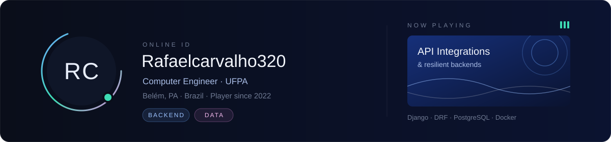

 
 

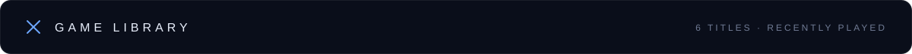

  <a href="https://github.com/Rafaelcarvalho320/webhook-gateway"></a>
  <a href="https://github.com/Rafaelcarvalho320/resilient-api-client"></a>
  <a href="https://github.com/Rafaelcarvalho320/django-nplus1-guard"></a>
  <a href="https://github.com/Rafaelcarvalho320/django-docker-starter"></a>
  <a href="https://github.com/Rafaelcarvalho320/reconciliation-report"></a>
  <a href="https://github.com/Rafaelcarvalho320/melanoma-symmetry-analyzer"></a>

 


 
 

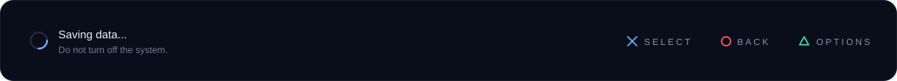
